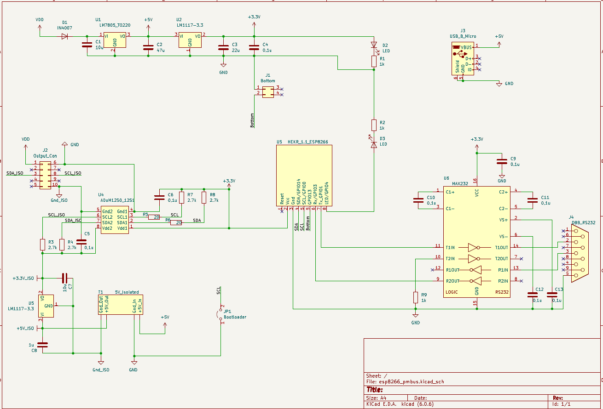
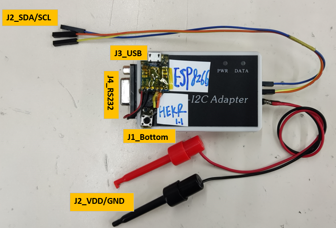

# ESP8266 Boards Programming Software
 * [Arduino](https://www.arduino.cc/en/software) HW&SW Compatible. 
 * Boards HW Libraries [ESP8266](https://github.com/esp8266/Arduino)    
   
 ### Software for application  
 * Android APP
> 1. [Serial USB Terminal APP](https://play.google.com/store/apps/details?id=de.kai_morich.serial_usb_terminal&hl=en "https://play.google.com/store/apps/details?id=de.kai_morich.serial_usb_terminal&hl=en")  

> 2. [MQTT Dashboard APP](https://play.google.com/store/apps/details?id=com.app.vetru.mqttdashboard "https://play.google.com/store/apps/details?id=com.app.vetru.mqttdashboard")  
> 3. [JuiceSSH APP](https://play.google.com/store/apps/details?id=com.sonelli.juicessh "https://play.google.com/store/apps/details?id=com.sonelli.juicessh")  
*OS Software 
> 1. [PYTHON MQTT](https://pypi.org/project/paho-mqtt/ "https://pypi.org/project/paho-mqtt/")  

### Schematic & Adapter
  

  

