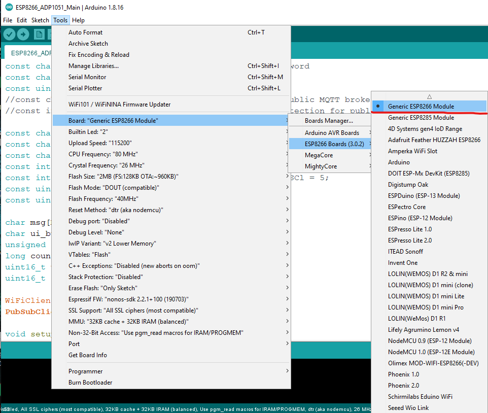
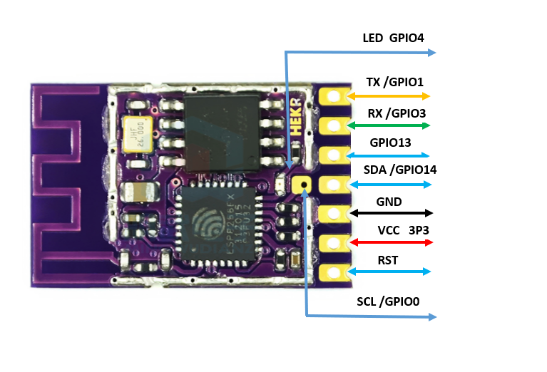
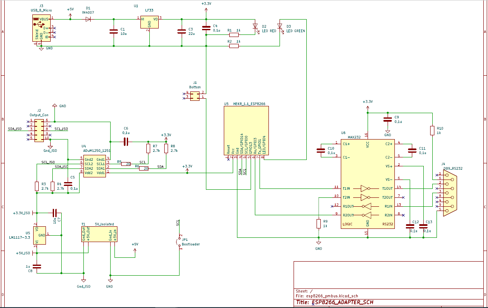
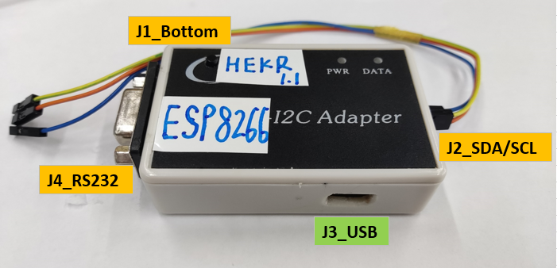
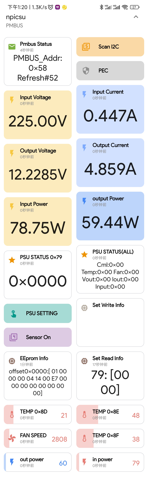
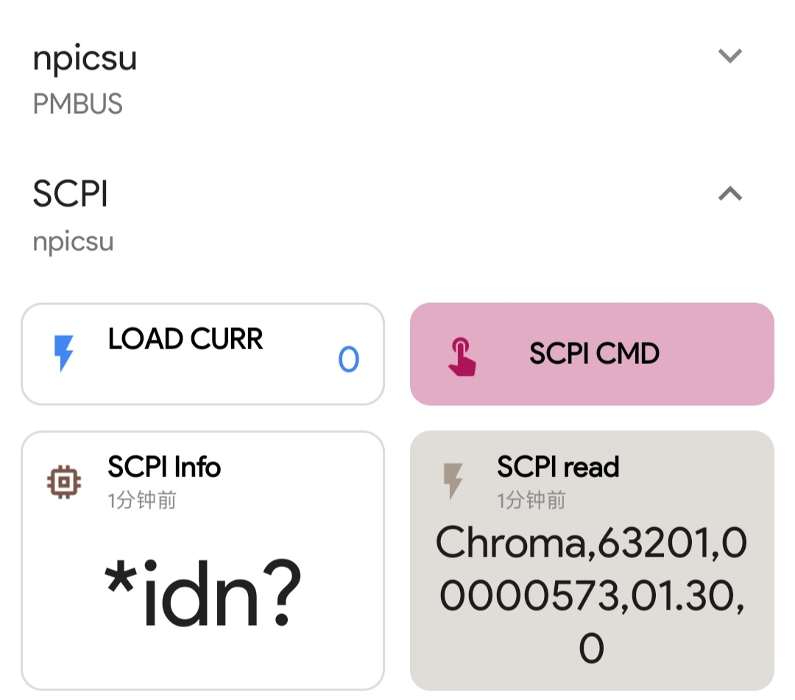
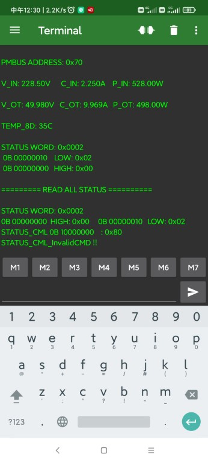

### ESP8266 HW & Programming Software
 * [Arduino](https://www.arduino.cc/en/software) HW&SW Compatible. 
 * Boards HW Libraries [ESP8266](https://github.com/esp8266/Arduino)    
   
 
 ###  Client Application Software for Mobile & PC  
 
 * Android APP
> 1. [Serial USB Terminal APP](https://play.google.com/store/apps/details?id=de.kai_morich.serial_usb_terminal&hl=en "https://play.google.com/store/apps/details?id=de.kai_morich.serial_usb_terminal&hl=en")  
> 2. [MQTT Dashboard APP](https://play.google.com/store/apps/details?id=com.app.vetru.mqttdashboard "https://play.google.com/store/apps/details?id=com.app.vetru.mqttdashboard")  
> 3. [JuiceSSH APP](https://play.google.com/store/apps/details?id=com.sonelli.juicessh "https://play.google.com/store/apps/details?id=com.sonelli.juicessh")  

* PC APP
> 1. [MQTTBox](https://github.com/workswithweb/MQTTBox)  

* Mqtt python
> 1. [PYTHON MQTT](https://pypi.org/project/paho-mqtt/ "https://pypi.org/project/paho-mqtt/")  
> 2. [Adapter Mqtt Script](Mqtt_Scripts/MQTT2Twi.py)  

### [Schematic](Doc/esp8266_pmbus_c.pdf) & Adapter
  
  

### App & Software

