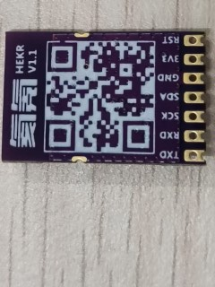

# ESP8266 Boards 

 * [Arduino](https://www.arduino.cc/en/software) HW&SW Compatible. 
 * Boards HW Libraries [ESP8266](https://github.com/esp8266/Arduino)    
 ### Software for mqtt  
 
  

  

  

  

  

